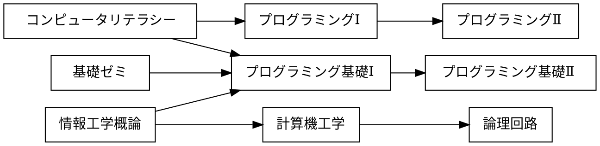

# マークダウンによる図の作成

講義資料と sample.md 内の記述を参考にして，exercise.md 内の4つの課題に回答せよ．
# 課題

## 課題 3.1 有向グラフ


プレビュー結果が上の図のようになるように，下記の記述を完成させよ．(接続関係が正しければ，上下が入れ替わっても構わない)

※ 日本語の文字列に対する箱の大きさが適切でない場合には，前後に空白を入れて調整せよ



## 課題 3.2 WBS


プレビュー結果が上の図のようになるように，下記の記述を完成させよ．(色や影などの違いは気にしなくてよい)

```plantUML
@startwbs ex02
* 拓殖大学
** 商学部
*** 経営学科
*** 国際ビジネス学科
*** 会計学科
** 政経学部
*** 法律政治学科
*** 経済学科
*** 社会安全学科
** 外国語学部
*** 英米語学科
*** 中国語学科
*** スペイン語学科
*** 国際日本語学科
** 工学部
*** 機械システム学科
*** 電子システム学科
*** 情報工学科
*** デザイン学科
** 国際学部
*** 国際学科

@endwbs
```

## 課題 3.3 ユースケース図


プレビュー結果が上の図のようになるように，下記の記述を完成させよ．ただし，別名については適当に設定してよい．(色や影などの違いは気にしなくてよい)

```plantUML
@startuml ex03
left to right direction
actor 学生 as student
actor 教員 as teacher
rectangle {
    usecase "提出結果の採点" as 1
    usecase "リモートリポジトリにpush" as 2
    usecase "修正のコミット" as 3
    usecase "修正をステージに上げる" as 4
    usecase "課題ファイルの修正" as 5
    usecase "リポジトリのクローン" as 6
    usecase "課題の受領" as 7
    usecase "課題の登録" as 8
}
student --> 2
student --> 3
student --> 4
student --> 5
student --> 6
student --> 7
8 <-- teacher
1 <-- teacher
@enduml
```

## 課題 3.4 オリジナルの図解

「有向グラフ」「WBS」「ユースケース図」のどれかを使って，
独自の図解を作成せよ．対象は自由に決めてよいが，
誰かのコピーにならないように留意せよ．

```plantUML
@startwbs ex02
* カレーの作り方
** 材料を用意する
*** カレールー
*** 豚肉
*** 玉ねぎ
*** ジャガイモ
*** にんじん
*** サラダ油
*** 調味料(お好みで)
** 具材を切る
*** 玉ねぎを半分に切る
**** 平らな面を下にして芯などを取り除き、放射線状のくし切りにする
*** ジャガイモを6~8等分にする
*** にんじんを縦半分に切る
**** 平らな面を下にして3cmくらいの大きさの乱切りにする
** 具材を炒める
*** サラダ油を敷く
*** 豚肉を入れる
**** 焼き目がつくまで待つ
*** 玉ねぎを入れる
**** しんなりするまで待つ
*** ジャガイモを入れる
*** にんじんを入れる
** 煮る
*** 水を加える
*** アクを取る
*** 煮込む
*** カレールーを入れる
** 仕上げ
*** 調味料を入れる
*** 皿によそう

@endwbs
```


## チェック
- [x] 課題 3.1 有向グラフ
- [x] 課題 3.2 WBS
- [x] 課題 3.3 ユースケース図
- [x] 課題 3.4 オリジナルの図解

